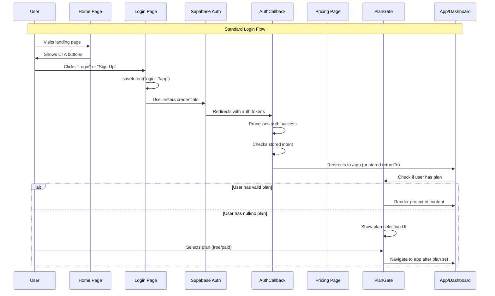
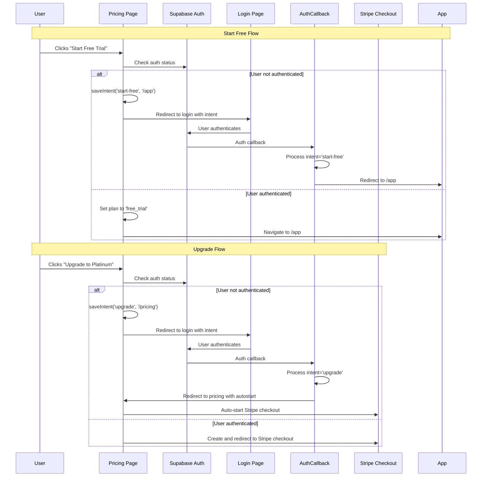
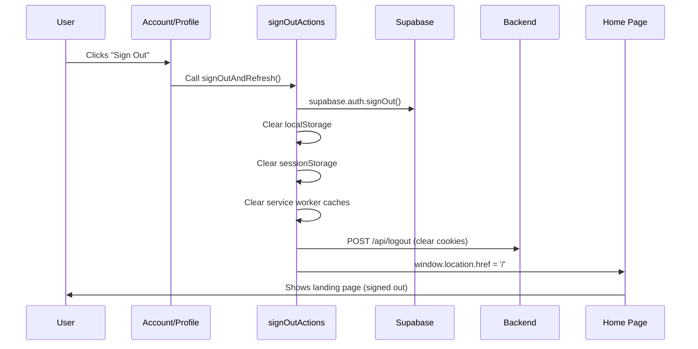
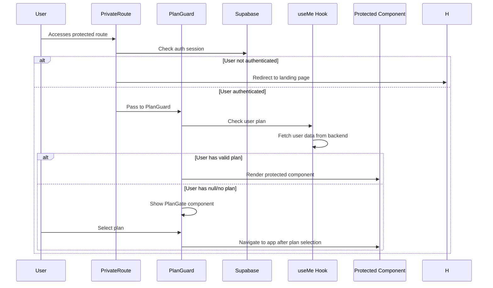
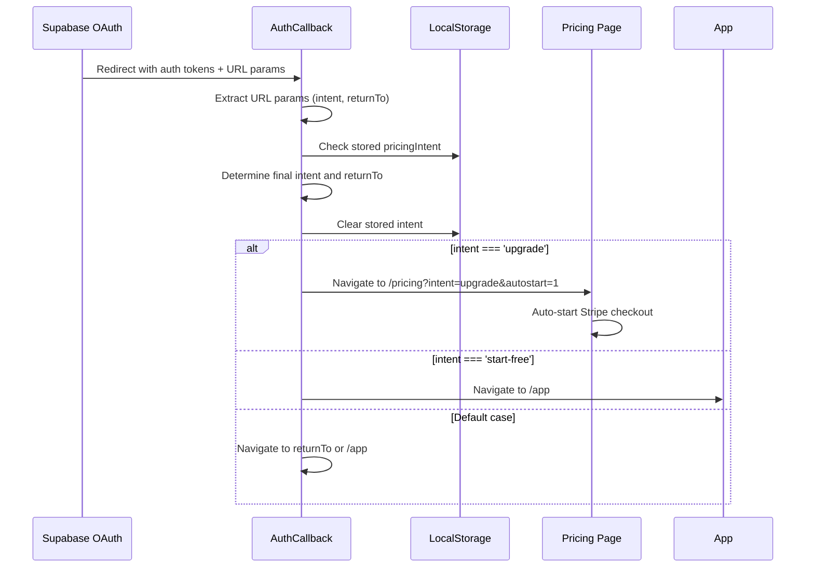
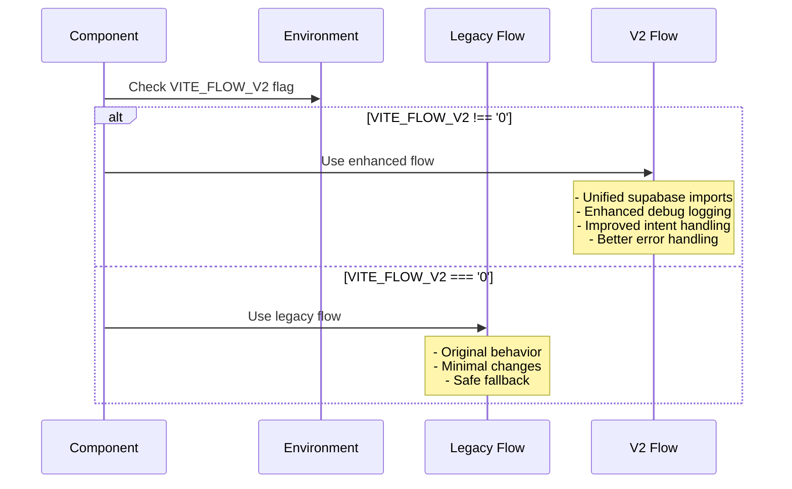
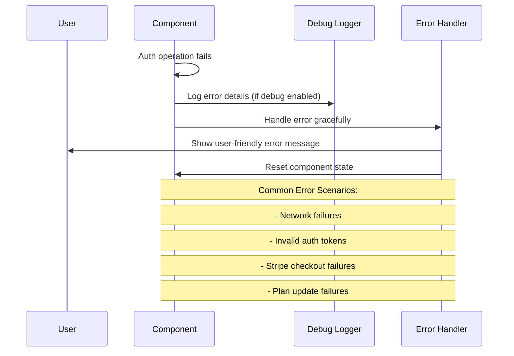

# Authentication Flow Sequence Diagram

This document provides a visual representation of the authentication flows in the VR-Odds platform.

## Main Authentication Flow

## Pricing Button Flows

## Sign Out Flow

## Protected Route Access

## OAuth Callback Processing

## Feature Flag Integration

## Error Handling Flow

## Key Components and Their Roles

### Authentication Components
- **PrivateRoute**: Guards protected routes, redirects unauthenticated users to landing page
- **PlanGuard**: Ensures authenticated users have valid plans, shows PlanGate if needed
- **AuthCallback**: Processes OAuth redirects and handles intent-based routing
- **signOutActions**: Centralized sign out logic with comprehensive cleanup

### Intent Persistence
- **saveIntent()**: Stores user intent in localStorage with 30-minute expiry
- **getIntent()**: Retrieves and validates stored intent
- **clearIntent()**: Removes expired or processed intents

### Debug System
- **debugLog()**: General purpose logging gated by VITE_DEBUG_FLOW
- **debugPricingClick()**: Logs pricing button interactions
- **debugCheckoutResult()**: Logs Stripe checkout outcomes
- **debugRedirectDecision()**: Logs routing decisions

### Feature Flags
- **VITE_FLOW_V2**: Gates new authentication and routing logic
- **VITE_DEBUG_FLOW**: Enables debug logging in development

This sequence diagram shows how all components work together to provide a seamless authentication experience with proper intent preservation and error handling.
