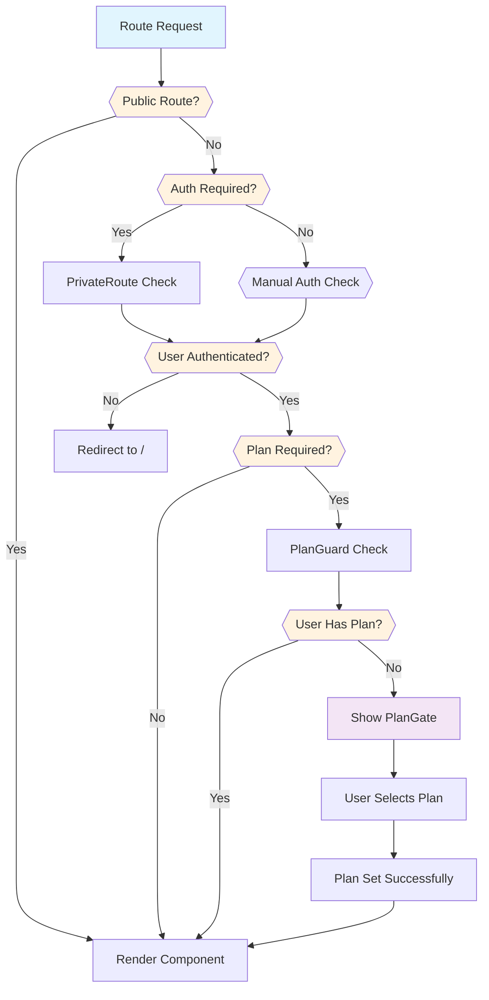
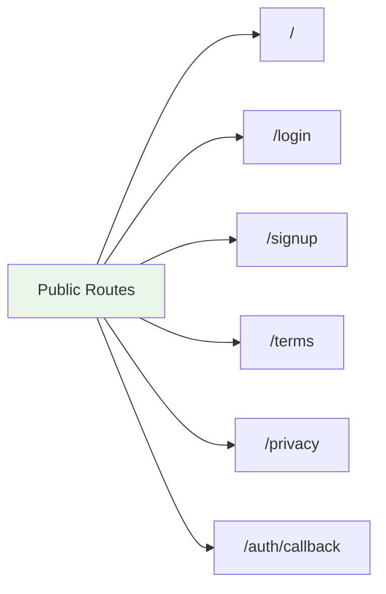
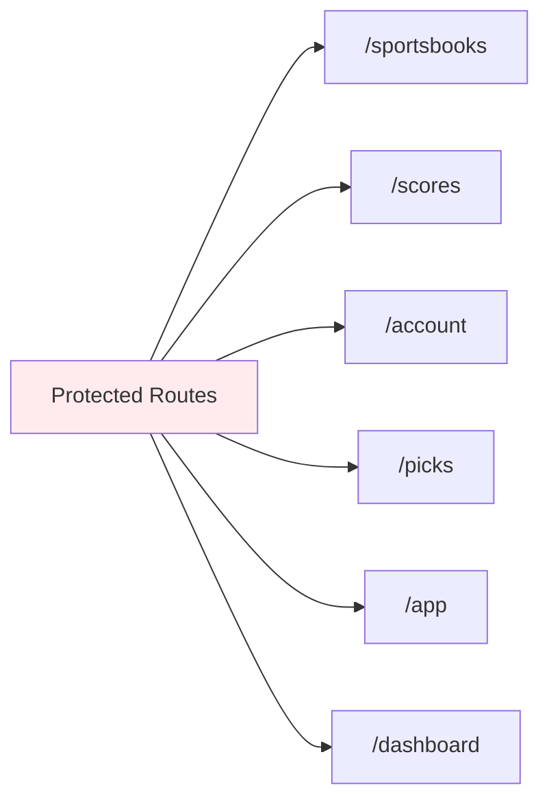
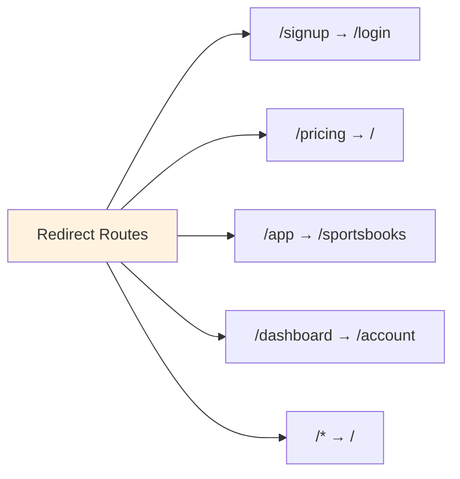
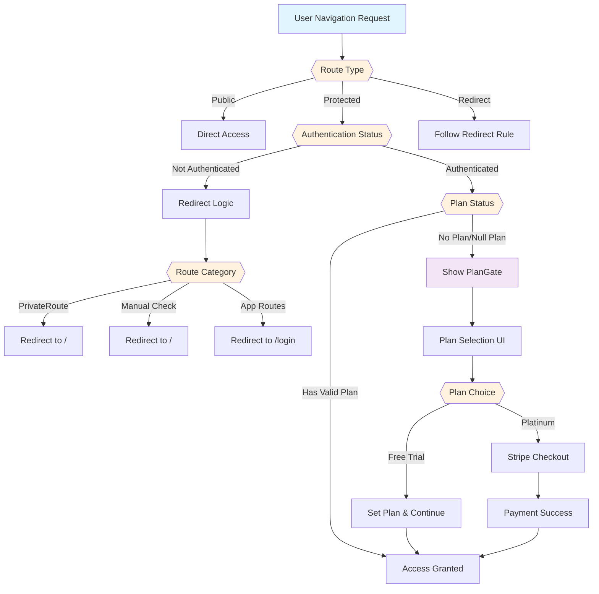
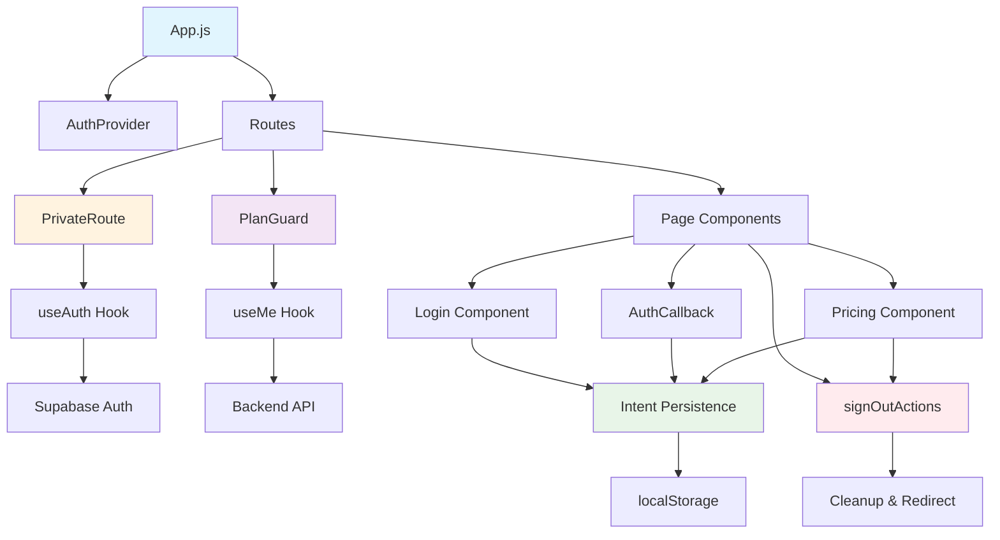

# Router Graph Diagram

This document provides a visual representation of the routing structure and navigation flows in the VR-Odds platform.

## Route Hierarchy and Guards

```mermaid
graph TD
    A["/"] --> B["Home Page"]
    A --> C["/login"]
    A --> D["/signup → /login"]
    A --> E["/pricing → /"]
    A --> F["/terms"]
    A --> G["/privacy"]
    A --> H["/auth/callback"]
    
    C --> I["Login Component"]
    H --> J["AuthCallback Component"]
    
    A --> K["/sportsbooks"]
    A --> L["/scores"] 
    A --> M["/account"]
    A --> N["/picks"]
    A --> O["/app → /sportsbooks"]
    A --> P["/dashboard → /account"]
    
    K --> Q{{"Auth Check"}}
    L --> R{{"Auth Check"}}
    M --> S{{"PrivateRoute"}}
    N --> T{{"PrivateRoute"}}
    O --> U{{"Auth Check"}}
    P --> V{{"Auth Check"}}
    
    Q -->|Authenticated| W{{"PlanGuard"}}
    R -->|Authenticated| X{{"PlanGuard"}}
    S -->|Authenticated| Y{{"PlanGuard"}}
    T -->|Authenticated| Z{{"PlanGuard"}}
    U -->|Authenticated| AA{{"PlanGuard"}}
    V -->|Authenticated| BB{{"PlanGuard"}}
    
    Q -->|Not Authenticated| CC["Redirect to /"]
    R -->|Not Authenticated| DD["Redirect to /"]
    S -->|Not Authenticated| EE["Redirect to /"]
    T -->|Not Authenticated| FF["Redirect to /"]
    U -->|Not Authenticated| GG["Redirect to /login"]
    V -->|Not Authenticated| HH["Redirect to /login"]
    
    W -->|Has Plan| II["SportsbookMarkets"]
    X -->|Has Plan| JJ["Scores"]
    Y -->|Has Plan| KK["Account"]
    Z -->|Has Plan| LL["MyPicks"]
    AA -->|Has Plan| MM["Redirect to /sportsbooks"]
    BB -->|Has Plan| NN["Redirect to /account"]
    
    W -->|No Plan| OO["PlanGate"]
    X -->|No Plan| PP["PlanGate"]
    Y -->|No Plan| QQ["PlanGate"]
    Z -->|No Plan| RR["PlanGate"]
    AA -->|No Plan| SS["PlanGate"]
    BB -->|No Plan| TT["PlanGate"]
    
    style A fill:#e1f5fe
    style Q fill:#fff3e0
    style R fill:#fff3e0
    style S fill:#fff3e0
    style T fill:#fff3e0
    style U fill:#fff3e0
    style V fill:#fff3e0
    style W fill:#f3e5f5
    style X fill:#f3e5f5
    style Y fill:#f3e5f5
    style Z fill:#f3e5f5
    style AA fill:#f3e5f5
    style BB fill:#f3e5f5
```

## Authentication Flow Routes

```mermaid
graph LR
    A["Unauthenticated User"] --> B["/"]
    B --> C["Home Page"]
    C --> D["/login"]
    C --> E["/signup"]
    
    D --> F["Login Component"]
    E --> F
    
    F --> G["Supabase Auth"]
    G --> H["/auth/callback"]
    H --> I["AuthCallback"]
    
    I --> J{{"Intent Check"}}
    J -->|upgrade| K["/pricing?intent=upgrade&autostart=1"]
    J -->|start-free| L["/app"]
    J -->|default| M["returnTo or /app"]
    
    K --> N["Auto-start Stripe Checkout"]
    L --> O{{"PlanGuard"}}
    M --> O
    
    O -->|Has Plan| P["Protected Content"]
    O -->|No Plan| Q["PlanGate Component"]
    
    Q --> R["Plan Selection"]
    R -->|Free Trial| S["Set free_trial plan"]
    R -->|Platinum| T["Stripe Checkout"]
    
    S --> P
    T --> U["Stripe Success"]
    U --> P
    
    style A fill:#ffebee
    style G fill:#e8f5e8
    style J fill:#fff3e0
    style O fill:#f3e5f5
    style Q fill:#e1f5fe
```

## Route Protection Layers

## Route Categories and Access Patterns

### Public Routes (No Auth Required)

### Protected Routes (Auth + Plan Required)

### Redirect Routes

## Navigation Decision Tree

## Component Interaction Map

## Route Guard Summary

| Route | Auth Required | Plan Required | Guard Type | Redirect Target |
|-------|---------------|---------------|------------|-----------------|
| `/` | No | No | None | N/A |
| `/login` | No | No | None | N/A |
| `/signup` | No | No | Redirect | `/login` |
| `/pricing` | No | No | Redirect | `/` |
| `/terms` | No | No | None | N/A |
| `/privacy` | No | No | None | N/A |
| `/auth/callback` | No | No | None | N/A |
| `/sportsbooks` | Yes | Yes | Manual + PlanGuard | `/` if not authed |
| `/scores` | Yes | Yes | Manual + PlanGuard | `/` if not authed |
| `/account` | Yes | Yes | PrivateRoute + PlanGuard | `/` if not authed |
| `/picks` | Yes | Yes | PrivateRoute + PlanGuard | `/` if not authed |
| `/app` | Yes | Yes | Manual + PlanGuard | `/login` if not authed |
| `/dashboard` | Yes | Yes | Manual + PlanGuard | `/login` if not authed |
| `/*` | No | No | Redirect | `/` |

## Key Routing Principles

1. **Unauthenticated users** are redirected to the landing page (`/`) for most protected routes
2. **App routes** (`/app`, `/dashboard`) redirect to `/login` when not authenticated
3. **All protected routes** require both authentication and a valid plan
4. **PlanGate** intercepts users with null/no plans and forces plan selection
5. **Intent persistence** preserves user goals across authentication flows
6. **Feature flags** allow safe rollback of new routing logic
7. **Debug logging** tracks all routing decisions for troubleshooting

This routing structure ensures a consistent user experience while maintaining security and proper access control.
